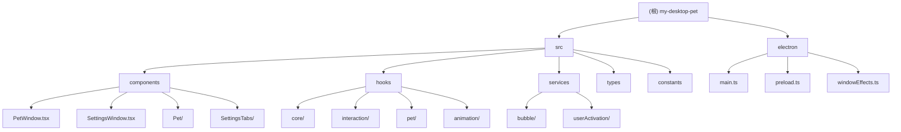

# CLAUDE.md

This file provides guidance to Claude Code (claude.ai/code) when working with code in this repository.

## 项目愿景

创建一个互动性强、功能丰富的桌面宠物应用，结合现代前端技术栈，提供沉浸式的虚拟宠物体验。应用支持多种宠物类型、丰富的交互方式、游戏化元素（任务、成就、等级系统）和高度可定制的外观设置。

## 架构总览

### 双窗口系统
- **宠物窗口**: 全屏透明覆盖层，使用 CSS 变换进行平滑移动
- **设置窗口**: 标准 Electron 窗口，用于配置和自定义
- **通信机制**: IPC 通道实现主进程与渲染进程间的通信

### 状态管理
- **Context API**: `PetStatusContext` 和 `BubbleContext` 管理 React 状态
- **持久化策略**: 原子文件写入 + 备份机制（主文件 + 备份文件 + 临时文件）
- **存储位置**: 宠物状态保存在 `userData/pet-state.json`

## 模块结构图

## 模块索引

| 模块路径 | 职责描述 | 关键文件 | 技术栈 |
|---------|---------|---------|--------|
| `electron/` | Electron 主进程，窗口管理，系统集成 | `main.ts`, `preload.ts`, `windowEffects.ts` | Electron 30, Node.js API |
| `src/components/` | React UI 组件，宠物展示，设置界面 | `PetWindow.tsx`, `SettingsWindow.tsx`, `Pet/` | React 18, React Icons |
| `src/hooks/` | 业务逻辑和状态管理，按功能组织 | `usePetStatus.ts`, `usePetInteraction.ts` | React Hooks, TypeScript |
| `src/services/` | 核心业务服务，状态持久化，用户交互 | `BubbleContext.tsx`, `UserActivationManager.ts` | Context API, Electron API |
| `src/types/` | TypeScript 类型定义，确保类型安全 | `petTypes.ts`, `windowEffects.ts` | TypeScript 5.2 |
| `src/constants/` | 配置常量，游戏数据，默认设置 | `petConstants.ts`, `taskData.ts` | TypeScript, JSON |

## 关键目录

- `electron/` - 主进程代码（main.ts, preload.ts, windowEffects.ts）
- `src/` - React 渲染进程
- `src/hooks/` - 按功能组织的自定义 hooks（animation, core, interaction, pet, settings）
- `src/components/` - 宠物和设置 UI 的 React 组件
- `src/services/` - 业务逻辑和状态管理
- `src/types/` - TypeScript 类型定义

## 技术特性

### 宠物定位系统
- **CSS 变换**: 使用 CSS transforms 而非窗口定位，确保平滑移动
- **全屏覆盖**: 宠物窗口为全屏透明覆盖，提供最佳的交互体验
- **边界检测**: 智能边界检测，防止宠物移出屏幕

### 窗口特效管理
- **丝滑置顶**: 通过 windowEffects.ts 实现平滑的置顶效果
- **防闪烁**: 特殊的窗口管理逻辑，避免闪烁和卡顿
- **动画系统**: 支持多种动画效果和过渡

### 鼠标交互
- **动态穿透**: 根据交互状态动态调整鼠标穿透设置
- **触觉反馈**: 支持触觉反馈，增强交互体验
- **眼球追踪**: 实时眼球追踪，增强宠物生动性

### 性能优化
- **独立配置**: 开发和生产环境的性能配置分离（performanceConfig.ts）
- **图像预加载**: 智能图像预加载，提升显示性能
- **状态缓存**: 高效的状态管理和缓存机制

## 开发规范

### 命名约定
- **组件**: 使用 PascalCase（如 `PetWindow.tsx`）
- **Hooks**: 使用 use 前缀 + 驼峰命名（如 `usePetStatus.ts`）
- **类型**: 使用 PascalCase（如 `PetStatus.ts`）
- **常量**: 使用 UPPER_SNAKE_CASE（如 `PET_TYPES`）

### 代码组织
- **单一职责**: 每个模块和文件都有明确的职责
- **类型安全**: 完整的 TypeScript 类型覆盖
- **模块化**: 高度模块化的设计，便于维护和扩展
- **文档化**: 每个模块都有详细的文档说明

### 状态管理
- **Context API**: 使用 React Context 进行状态管理
- **自定义 Hooks**: 通过自定义 hooks 封装复杂逻辑
- **状态持久化**: 自动状态保存和恢复机制
- **原子更新**: 使用原子更新避免状态不一致

## AI 使用指引

### 代码修改原则
- **保持架构**: 遵循现有的模块化架构和代码组织方式
- **类型安全**: 确保所有修改都有正确的 TypeScript 类型定义
- **向后兼容**: 保持向后兼容性，避免破坏现有功能
- **性能考虑**: 注意性能影响，避免不必要的重渲染和计算

### 添加新功能
- **模块化**: 在合适的模块中添加新功能
- **类型定义**: 先定义类型，再实现功能
- **测试**: 确保新功能经过充分测试
- **文档**: 更新相关文档和注释

### 常见任务
- **添加宠物类型**: 在 `src/constants/petConstants.ts` 中添加，更新 `src/types/petTypes.ts`
- **添加新交互**: 在 `src/hooks/interaction/` 中添加相关 hooks
- **添加新设置**: 在 `src/components/SettingsTabs/` 中添加新的设置页面
- **修改状态管理**: 在 `src/hooks/core/usePetStatus.ts` 中修改

## 常用命令

- `npm run dev` - 开发模式（自动打开开发者工具）
- `npm run build` - 完整构建流程：TypeScript 编译 → Vite 构建 → Electron Builder 打包
- `npm run lint` - 运行 ESLint 检查（TypeScript 和 React Hooks 规则）
- `npm run preview` - 预览构建后的应用

## 开发注意事项

- **TypeScript**: 启用严格模式，完整的代码检查
- **React 18**: 使用函数组件和 hooks 模式
- **全局快捷键**: Alt+P 切换宠物窗口可见性
- **开发模式**: 自动在宠物窗口打开开发者工具
- **绝对导入**: 为 `src/` 和 `electron/` 目录配置了绝对导入

---

## 变更记录 (Changelog)

### 2025-09-23 22:28
- 🎯 **架构升级**: 完整的模块化架构设计
- 📊 **模块文档**: 为所有模块生成详细的 CLAUDE.md 文档
- 🗺️ **结构图**: 添加 Mermaid 模块结构图，支持点击导航
- 🎮 **游戏系统**: 完善任务、成就、等级系统
- 🎨 **交互体验**: 增强触觉反馈、眼球追踪、动画效果
- 📱 **用户激活**: 添加用户激活管理和首次交互保护
- 🔧 **性能优化**: 智能图像预加载、窗口特效管理
- 🛡️ **类型安全**: 完整的 TypeScript 类型覆盖和检查